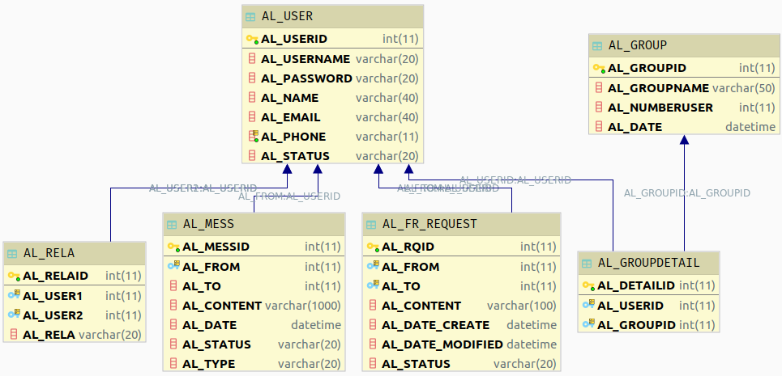
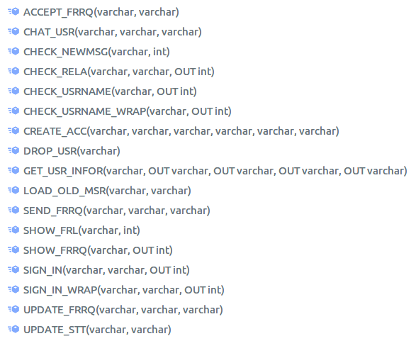

# Bài tập App chat đơn giản với Python và MySQL

## Công cụ

1. IDE

- [MySQL Server](https://www.digitalocean.com/community/tutorials/how-to-install-mysql-on-ubuntu-18-04)
- [MySQL workbench](https://askubuntu.com/questions/45115/how-to-install-mysql-workbench)
- [PyCharm](https://www.jetbrains.com/pycharm/)

2. Thư viện

- Kết nối MySQL - Python: [PyMysql](https://o7planning.org/vi/11463/ket-noi-mysql-database-trong-python-su-dung-pymysql)

## Ý tưởng

Kết nối MySQL server, database thông qua query execute procedure.

Database:

Store procedure:

## Hướng dẫn chạy code

1. Cài đặt các công cụ như trên
2. Sử dụng My SQL Workbench kết nối vào MySQL Server, mở file DB.sql và SP.sql trong thư mục database, chạy lần lượt từng file.
3. Dùng PyCharm mở thư mục python, chọn chuột phải vào file myMain.py chọn run.
