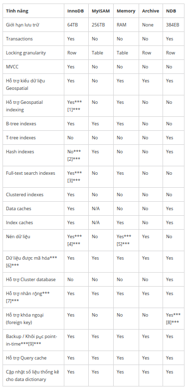

# MYSQL

<!-- TOC -->
- [MYSQL](#MYSQL)
  - [STORAGE ENGINE (SE)](#STORAGE-ENGINE-SE)
  - [INSTALLATION & MANIPULATION](#INSTALLATION--MANIPULATION)
  - [DATA TYPES](#DATA-TYPES)
  - [TRANSACTION](#TRANSACTION)
  - [ISOLATION](#ISOLATION)
  - [CONNECTOR](#CONNECTOR)
  - [NGUỒN THAM KHẢO](#NGU%E1%BB%92N-THAM-KH%E1%BA%A2O)

<!-- /TOC -->

## STORAGE ENGINE (SE)

1. Các loại storage engine cơ bản của MySQL:

- MySQL version 8.0 hỗ trợ các loại SE tiêu biểu như: InnoDB, MyISAM, Memory, Archive, CSV, Example, Blackhole, NDB, Merge, Federated.
- Ở đây, mình sẽ phân tích 8 engine ngoại trừ 2 engine (Merge, Blackhole).
- Mỗi engine có những đặc điểm và tình huống sử dụng riêng biệt, nhưng một vài engine thông dụng lại chứa luôn cả engine khác, nên ta cần phải cân nhắc chọn lựa hoặc kết hợp các loại SE khác nhau cho hệ thống của mình.

2. InnoDB


- Giới thiệu: InnoDB là một công cụ lưu trữ đa năng, cân bằng độ tin cậy cao và hiệu suất cao. Trong MySQL 8.0, InnoDB là công cụ lưu trữ mặc định của MySQL. Trừ khi ta đã cấu hình một công cụ lưu trữ mặc định khác, việc đưa ra câu lệnh CREATE TABLE mà không có mệnh đề `ENGINE=<TypeOfSE>` sẽ tạo bảng InnoDB.
- Ưu điểm:
  - Các hoạt động DML của nó tuân theo mô hình ACID với các giao dịch có tính năng cam kết, rollback và khôi phục sự cố để bảo vệ dữ liệu người dùng.
  - Có cơ chế row-level locking với 2 loại:
    - Shared locks: Cho phép giao dịch giữ khóa để đọc một hàng.
    - Exclusive locks: Cho phép giao dịch giữ khóa để cập nhật hoặc xóa một hàng.
  - Các bảng InnoDB sắp xếp dữ liệu trên đĩa để tối ưu hóa các truy vấn dựa trên các khóa chính. Mỗi bảng InnoDB có một chỉ mục khóa chính (còn được gọi là chỉ mục được clustered) nhằm tổ chức hóa dữ liệu để giảm thiểu I/O cho việc tra cứu khóa chính.
  - Để duy trì tính toàn vẹn dữ liệu, InnoDB hỗ trợ các ràng buộc FOREIGN KEY. Với các khóa ngoại, chèn, cập nhật và xóa được kiểm tra để đảm bảo chúng không dẫn đến sự không thống nhất giữa các bảng khác nhau.

```sql
        CREATE TABLE employee(
            id smallint(5) unsigned NOT NULL,
            firstname varchar(30),
            lastname varchar(30),
            PRIMARY KEY (id)
        ) ENGINE=InnoDB;
```

- Nhược điểm:
  - Tăng độ phức tạp, chẳng hạn việc tạo bảng InnoDB sẽ phải khai báo nhiều thứ và cầu kì hơn MyISAM. Đồng thời, việc thiết kế & link các khóa ngoại với nhau cũng cần nhiều "công sức".
  - Không tim kiếm full-text: Các bảng InnoDB không hỗ trợ tìm kiếm toàn văn bản; không dễ để so khớp một hoặc nhiều từ khóa với nội dung nhiều cột.
  - Hiệu năng chậm hơn: Nếu ứng dụng của bạn chủ yếu select dữ liệu và hiệu suất là ưu tiên, các bảng MyISAM thường sẽ nhanh hơn và sử dụng ít tài nguyên hệ thống hơn. Ngược lại, InnoDB sẽ nhanh hơn MyISAM ở việc ghi dữ liệu. Xem thêm lí do [tại đây](https://hackernoon.com/dont-waste-your-time-with-mysql-full-text-search-61f644a54dfa).
- Khi nào sử dụng InnoDB?
  - InnoDB là tùy chọn tốt nhất nếu bạn cần tạo một ứng dụng web dựa trên dữ liệu đáng tin cậy. Theo nhiều cách, InnoDB là một lựa chọn mặc định tốt hơn MyISAM.
  - Trừ khi ta có một hệ thống lớn hoặc được sử dụng với tần suất cao, sự khác biệt về tốc độ có thể không đáng kể thì InnoDB cũng là một ứng viên phù hợp.
  - InnoDB chắc chắn là sự lựa chọn tốt nhất cho các cửa hàng trực tuyến, ứng dụng tài chính hoặc bất kỳ dự án nào mà tính toàn vẹn dữ liệu là điều cần thiết. Việc xác định các bảng phức tạp hơn, nhưng ứng dụng của bạn sẽ mạnh mẽ hơn (với các thông tin về bảng & ràng buộc một cách rõ ràng) và có thể yêu cầu ít mã lệnh thực thi phía máy chủ hơn.
  - Có cách khác để tìm kiếm full-text mà thuật toán ấy tăng hiệu suất của InnoDB lên. Chẳng hạn như dùng Match Against kết hợp với Select. Xem thêm [tại đây](https://www.digitalocean.com/community/tutorials/how-to-improve-database-searches-with-full-text-search-in-mysql-5-6-on-ubuntu-16-04).
- Tính ACID:
  - Tính nguyên tố (Atomicity): Một giao dịch có nhiều thao tác khác biệt, do đó toàn bộ các thao tác đều được hoàn thành hoặc là không một thao tác nào được hoàn thành. Chẳng hạn việc chuyển tiền có thể thành công hay trục trặc vì nhiều lý do nhưng tính nguyên tố bảo đảm rằng một tài khoản sẽ không bị trừ tiền nếu như tài khoản kia chưa được cộng số tiền tương ứng.
  - Tính nhất quán (Consistency): Một giao dịch sẽ phải tạo ra một trạng thái mới và hợp lệ cho dữ liệu, hoặc trong trường hợp có lỗi thì nó sẽ chuyển toàn bộ dữ liệu về trạng thái trước khi thực thi giao dịch. (Giống như rollback)
  - Tính độc lập (Isolation): Một giao dịch đang thực thi và chưa được xác nhận phải bảo đảm tách biệt khỏi các giao dịch khác.
  - Tính bền vững (Durability): Dữ liệu được xác nhận sẽ được hệ thống lưu lại sao cho ngay cả trong trường hợp hỏng hóc hoặc có lỗi hệ thống, dữ liệu vẫn đảm bảo trong trạng thái chuẩn xác.

3. MyISAM


- Giới thiệu:
  - MyISAM dựa trên SE cũ kĩ mang tên **ISAM**, nhưng nó vẫn còn nhiều tính năng hữu ích nên giờ đây đã được nâng cấp và đổi tên thành MyISAM.
  - Mỗi bảng MyISAM được lưu trữ trên đĩa trong hai file. Các file có tên bắt đầu bằng tên bảng và có phần mở rộng để chỉ ra loại file. File dữ liệu có phần mở rộng .MYD (MYData). File chỉ mục có phần mở rộng .MYI (MY Index). Định nghĩa bảng được lưu trữ trong từ điển dữ liệu MySQL.
- Cách tạo bảng với loại SE MyISAM:

```sql
    CREATE TABLE t (i INT) ENGINE = MYISAM;
```

```sql
        CREATE DATABASE mysqltest;
        USE mysqltest;

        CREATE TABLE mysqltest.articles (
            id int UNSIGNED NOT NULL AUTO_INCREMENT,
            title TEXT NOT NULL,
            body MEDIUMTEXT,
            PRIMARY KEY (id)
        ) ENGINE = MyISAM;
```

- Ưu điểm:
  - Đơn giản hóa: Bảng MyISAM rất đơn giản. Nếu bạn chưa quen với MySQL hoặc cơ sở dữ liệu nói chung, bạn có thể bắt đầu với các bảng MyISAM. Trong ví dụ sau, ta sẽ tạo một CSDL và bảng mới từ dấu nhắc lệnh `mysql>`. Đoạn code bên dưới tạo ra một CSDL mới tên mysqltest và một bảng mới có tên articles với các cột là ID (số được tạo tự động), title và body.
  - Tốc độ: MySQL rất nhanh. Trong điều kiện bình thường, benchmark cho thấy các bảng MyISAM đánh bại nhiều CSDL dùng SE khác (mục đích vẫn giống nhau) và sử dụng ít tài nguyên hệ thống hơn.
  - Tìm kiếm Full-text: Một giải pháp dễ dàng là thêm một chỉ mục fulltext với đoạn code bên dưới. Từ đó, hiệu năng tìm kiếm sẽ được đẩy lên "một tầm cao mới".

```sql
        ALTER TABLE mysqltest.articles ADD FULLTEXT alltext (title, body);
```

- Bây giờ, ta có thể tìm thấy tất cả các article mà nó chứa từ "database" và/hoặc "article" bằng cách:

```sql
        SELECT * FROM mysqltest.articles
        WHERE MATCH(title, body) AGAINST ('database article');
```

- Thậm chí, ta có thể xếp thứ tự các articles dựa trên mức độ liên quan nhằm tăng hiệu quả search lên cao hơn nữa:

```sql
        SELECT *, MATCH(title, body) AGAINST ('database article') AS rel
        FROM mysqltest.articles
        ORDER BY rel DESC;
```

- Nhược điểm:
  - Tính toàn vẹn dữ liệu kém: Các bảng MyISAM không hỗ trợ các giao dịch hoặc các ràng buộc khóa ngoại. Hãy xem xét một ứng dụng ngân hàng nơi bạn đang chuyển tiền. Điều này thường liên quan đến câu lệnh CẬP NHẬT DỮ LIỆU SQL, ghi nợ từ tài khoản này và tín dụng cho tài khoản khác. Nếu MySQL hoặc máy chủ không thành công ở một thời điểm sai nào đó, bạn có thể sẽ có tiền trong cả hai tài khoản hoặc không có tài khoản nào có tiền, dẫn đến hậu quả nghiêm trọng (kiện cáo, phàn nàn, thậm chí là ngân hàng bị giảm uy tín).
  - Phục hồi sự cố kém: MySQL là đáng tin cậy, nhưng các bảng sử dụng SE loại MyISAM này có thể bị hỏng sau khi gặp sự cố. Vấn đề này thường có thể được khắc phục bằng REPAIR TABLE nhưng chi phí quản trị bảng, CSDL sẽ tăng thêm.
- Table-locking:
  - MyISAM sử dụng table-locking. Khi một hàng được chèn hoặc cập nhật, tất cả các thay đổi khác đối với bảng đó sẽ được duy trì (nghĩa là bị khóa, bị ngưng hoạt động) cho đến khi yêu cầu thao tác với một hàng được hoàn thành. Rất bất tiện.
  - Nếu rất nhiều người đang thực hiện thêm, xóa, sửa thay vì select trên 1 bảng thì MyISAM không phải là loại kiểu bảng tốt nhất để chọn.
- Khi nào sử dụng MyISAM?
  - Là sự lựa chọn lý tưởng khi bạn bắt đầu làm quen với MySQL.
  - Làm cho việc lưu trữ trở nên đơn giản, nhanh gọn và dễ dàng sử dụng tìm kiếm Full-text.
  - Không nên sử dụng MyISAM cho bảng nếu tính toàn vẹn dữ liệu trong bài toán là ưu tiên hàng đầu.
  - Một vài ứng dụng có thể dùng MyISAM: Hệ thống quản lý nội dung, công cụ đánh dấu nội dung, công cụ tìm kiếm đơn giản,...

4. CSV

- Giới thiệu:
  - Lưu trữ dữ liệu trong các file văn bản bằng định dạng giá trị được phân tách bằng dấu phẩy.
  - Công cụ lưu trữ CSV luôn được biên dịch vào máy chủ MySQL.
  - Khi bạn tạo bảng CSV, máy chủ sẽ tạo file dữ liệu văn bản thuần khiết có tên bắt đầu bằng tên bảng và có phần đuôi mở rộng `.CSV`.
  - Tạo bảng CSV cũng tạo một siêu file (metafile) tương ứng lưu trữ *trạng thái* của bảng và *số lượng hàng tồn tại* trong bảng. Tên của file này giống với tên của bảng và có phần đuôi mở rộng là `.CSM`.
- Ưu điểm:
  - Dễ dàng đọc được và chỉnh sửa thủ công.
  - Đơn giản để thực hiện và phân tích cú pháp.
  - Nhỏ gọn, xử lý tương đối nhanh, kích cỡ lưu trữ cũng không quá bự.
- Nhược điểm:
  - Không hỗ trợ lập chỉ mục.
  - Không hỗ trợ phân vùng.
  - Tất cả các bảng bạn tạo bằng công cụ lưu trữ CSV phải có thuộc tính KHÔNG NULL trên tất cả các cột.
  - Không có sự phân biệt giữa kiểu văn bản và số.
- Lưu ý: Ta nên lưu dữ liệu trong các bảng InnoDB trong quá trình hoạt động và chỉ sử dụng các bảng CSV khi cần import hoặc export.

5. NDB (or NDBCLUSTER)

- Giới thiệu: Đặc biệt phù hợp với các ứng dụng đòi hỏi thời gian hoạt động và tính khả dụng cao nhất có thể.
- Ưu điểm:
- Nhược điểm:

6. Federated

- Giới thiệu:
- Ưu điểm:
- Nhược điểm:

7. Example

- Giới thiệu:
- Ưu điểm:
- Nhược điểm:

8. Archive

- Giới thiệu:
- Ưu điểm:
- Nhược điểm:

9. Memory

   

- Giới thiệu:
  - Công cụ lưu trữ MEMORY (trước đây gọi là HEAP) tạo các bảng mục đích đặc biệt với nội dung được lưu trữ trong bộ nhớ. Vì dữ liệu dễ bị hỏng, sự cố phần cứng hoặc mất điện, chỉ sử dụng các bảng này làm vùng làm việc tạm thời hoặc bộ đệm chỉ đọc cho dữ liệu được lấy từ các bảng kháCác trường hợp thường sử dụngCác hoạt động liên quan đến dữ liệu nhất thời, không quan trọng như quản lý phiên hoặc bộ đệm. Khi máy chủ MySQL tạm dừng hoặc khởi động lại, dữ liệu trong các bảng NHỚ sẽ bị mấtLưu trữ trong bộ nhớ để truy cập nhanh và độ trễ thấp. Khối lượng dữ liệu có thể vừa hoàn toàn trong bộ nhớ mà không khiến hệ điều hành hoán đổi các trang bộ nhớ ảoMẫu truy cập dữ liệu chỉ đọc hoặc đọc chủ yếu (cập nhật bị hạn chế).
- Ưu điểm:
  - Truy cập nhanh, độ trễ thấp, nhìn chung là hiệu suất cao. (Đọc và ghi dữ liệu hoàn toàn trong bộ nhớ nhanh hơn dữ liệu được lưu trữ trên đĩa hoặc trên ổ đĩa flashPhù hợp cho các trường hợp lưu trữ các bản ghi dữ liệu tạm thời.
- Nhược điểm:
  - Khả năng mất dữ liệu và giới hạn về kích thước CSDL có thể xảy ra. Nếu ta ngừng duy trì CSDL thì ta sẽ mất tính bền vững (D) trong ACID, và đó là một trong những nhược điểm của Memory Table khi tỉ lệ ngừng hoạt động có thể xảy ra rất cao (Chẳng hạn máy chủ tạm dừng hoặc tắt hoặc khởi động lại). Đồng thời, dữ liệu nở ra thì bộ nhớ RAM cũng sẽ thu hẹp dầKhông có hỗ trợ giao dịch và khóa ngoại, có nghĩa là bạn sẽ phải quản lý tính toàn vẹn của giao dịch và tính toàn vẹn tham chiếu một cách thủ công (điều này có thể kém hiệu quả hơn nhiều so với việc để CSDL tự làm điều nàyTable-level locking: Đây có thể là một rào cản đáng kể đối với khả năng mở rộng nếu ứng dụng của bạn cần nhiều trình ghi đồng thời vào cùng một tập hợp bảng hoặc trong trường hợp các thao tác đọc của bạn sử dụng khóa để đảm bảo đọc dữ liệu nhất quáKhông thể chứa các cột kiểu BLOB hoặc TEXT.

10.  Bảng tổng hợp tính năng của các Storage Engine



**CHÚ THÍCH:**

- [1] InnoDB hỗ trợ cho việc Geospatial indexing từ MySQL 5.7.5 trở lên.
- [2] InnoDB sử dụng Hash index nội bộ cho tính năng Hash Index của nó.
- [3] InnoDB hỗ trợ FULLTEXT từ MySQL 5.6.4 và sau đó.
- [4] Các bảng InnoDB đã nén được yêu cầu định dạng file InnoDB Barracuda.
- [5] Các bảng MyISAM nén chỉ được hỗ trợ khi sử dụng định dạng dòng nén. Các bảng sử dụng định dạng nén với MyISAM chỉ được đọc (readonly).
- [6] Thực hiện trên server (thông qua chức năng mã hóa). Mã hóa dữ liệu có sẵn từ MySQL 5.7 trở lên.
- [7] Thực hiện trên server thay vì Storage Engine.
- [8] Hỗ trợ cho khóa ngoại (foreign key) có sẵn từ MySQL Cluster NDB 7.3 và sau đó.
- [9] Thực hiện trên server thay vì Storage Engine.

## INSTALLATION & MANIPULATION

1. Giới thiệu sơ nét SQL Commands

   

- **DML (Data Manipulation Language):** Các câu lệnh SQL trong lớp DML này được dùng để lưu trữ, sửa đổi, truy vấn, cập nhật, thêm, xóa,... dữ liệu trong CSDSELECT: Rút trích dữ liệu từ (các bảng trong) CSDINSERT: Thêm dữ liệu vào bảnUPDATE: Cập nhật nội dung của dữ liệu đã tồn tại trong bảnDELETE: Xóa tất cả bản ghi (records) của bảng trong CSDMERGE - UPSERT: Thêm hoặc cập nhậCALL: Gọi chương trình con của Java hoặc PL/SQEXPLAIN PLAN: giải thích đường dẫn truy cập dữ liệLOCK TABLE: Kiểm soát đồng thời.
- **DDL (Data Definition Language):** Các câu lệnh SQL trong lớp DDL này được dùng để định nghĩa cấu trúc, hoặc khởi tạo CSDL, nhưCREATE: Tạo CSDL & các đối tượng của nó như bảng, index, views, store procedure, function and triggeDROP: Xóa các objects trong CSDL (Chẳng hạn DROP khóa ngoại, bảngALTER: Thay đổi cấu trúc của CSDL đang tồn tạTRUNCATE: Xóa tất cả bản ghi (records) của một bảng, bao gồm tất cả các không gian (space) được allocated cho các bản ghi được loại bỏ.Mức độ của TRUNCATE nguy hiểm hơn DELETE vì khi DELETE thì còn có transaction log để ghi lại những dữ liệu (theo từng dòng) đã được xóa, TRUNCATE thì không.Khi dùng DELETE mà ta thêm 1 record mới thì id sẽ tăng dần dựa theo giá trị id của record cuối cùng được tạo. TRUNCATE là xóa hết nguyên bảng chứ không thể dùng cho từng record, nên id sẽ bắt đầu lại từ đầu là 1TRUNCATE không thể chạy được khi bảng bạn định xóa có foreign_key trỏ đến bảng khác (nếu bảng đó có foreign_key trỏ đến chính nó thì bạn có thể xóa bình thường)Dữ liệu bị xóa bởi DELETE có thể restored được còn TRUNCATE thì khôngTRUNCATE sẽ luôn nhanh hơn vì nó tiêu tốn ít bộ nhớ hơn, bạn có thể cân nhắc điều này khi cần xóa 1 bảng lớn có nhiều recorCOMMENT: Thêm bình luận vào từ điển dữ liệRENAME: Đổi tên cho đối tượng
- **DCL (Data Control Language):** Ngôn ngủ chủ yếu liên quan đến các quyền truy cập, những điều khiển khác của hệ thống CSDGRANT: Cho phép người dùng truy cập đặc quyền vào CSDREVOKE: Rút đặc quyền truy cập của người dùng đã được cung cấp bởi lệnh GRANT.
- **TCL (Transaction Control Language):** Ngôn ngữ được sử dụng trong các trường hợp liên quan đến giao dịch trong CSDCOMMIT: Commits 1 giao dịcROLLBACK: Phục hồi (rollback) 1 giao dịch trong trường hợp có lỗi xảy rSAVEPOINT: Phục hồi (rollback) các điểm thực hiện giao dịch (transaction making points) trong các nhóSET TRANSACTION: Chỉ định các tính chất, đặc điểm cho giao dịch.
- **Giải thích ngữ nghĩa:**
  - Tuple: Một tuple là một nhóm các phần tử được sắp xếp, chẳng hạn (10, 25, 30Record: Một bản ghi thường là một nhóm các phần tử được đặt tên như {"x": 10, "y": 25, "z": 30Rollback: Là thao tác lùi cơ sở dữ liệu về một trạng thái cũ. Các thao tác rollback có tầm quan trọng đối với tính `toàn vẹn dữ liệu` của CSDL. Chúng giúp khôi phục CSDL về một bản sạch sẽ sau một số thao tác bị lỗi; phục hồi các sự cố sập server CSDL trong việc hủy bất cứ giao dịch nào đang chạy tại thời điểm xảy ra sự cố.

2. Cách thức cài đặt MySQL server trên Linux

3. Cách tạo DB (database) và table

4. Thao tác với MySQL

- **Select:**
- **Insert:**
- **Update:**
- **Delete:**
- **Alter:**

## DATA TYPES

1. Các kiểu dữ liệu cơ bản của MySQL

2. Các kiểu dữ liệu đặc biệt và cách xử lý

## TRANSACTION

1. Transaction là gì

2. Tại sao phải dùng transaction

3. Cách sử dụng transaction

4. Xử lý khi gặp lỗi transaction

5. Khái niệm transaction trong hệ thống phân tán

## ISOLATION

1. Isolation là gì

2. Isolation ở mức cơ bản

3. Xác định isolation level của MySQL để xử lý đồng thời (concurrency)

## CONNECTOR

1. Một số cách kết nối với MySQL: jdbc, python driver,...

## NGUỒN THAM KHẢO

1. <https://vi.wikipedia.org/wiki/Rollback_(qu%E1%BA%A3n_l%C3%BD_d%E1%BB%AF_li%E1%BB%87u)>
2. <https://stackoverflow.com/questions/4212265/tuples-vs-records>
3. <https://viblo.asia/p/phan-biet-truncate-va-delete-trong-sql-bWrZn16mKxw>
4. <https://stackoverflow.com/questions/2578194/what-is-ddl-and-dml>
5. <https://vi.wikipedia.org/wiki/ACID>
6. <https://dev.mysql.com/doc/refman/8.0/en/innodb-storage-engine.html>
7. <https://www.sitepoint.com/mysql-innodb-table-pros-cons/>
8. <https://aaronjwood.com/articles/database-engines/>
9. <https://dev.mysql.com/doc/refman/8.0/en/myisam-storage-engine.html>
10. <https://www.sitepoint.com/mysql-myisam-table-pros-con/>
11. <https://www.quora.com/What-are-the-pros-and-cons-of-CSV-files>
12. <https://dev.mysql.com/doc/refman/8.0/en/memory-storage-engine.html>
13. <https://dba.stackexchange.com/questions/1811/what-are-reasons-not-to-use-the-memory-storage-engine-in-mysql>
14. <https://dev.mysql.com/doc/refman/8.0/en/storage-engines.html>
